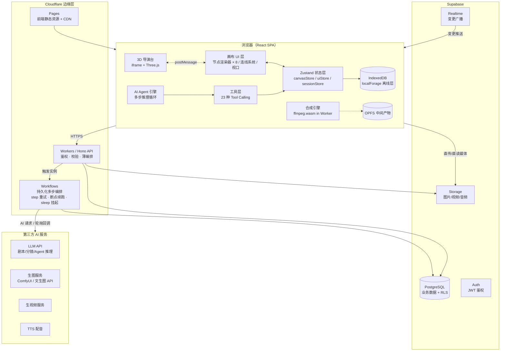

# 第 1 章 总体架构

## 1.1 项目定位与业务全景

### 1.1.1 一句话定位

面向漫剧（AI 生成的动态漫画短剧）创作者的 **一站式 AI 内容生产 SaaS**：用户输入一部小说文本，平台自动完成「剧本改编 → 分镜拆解 → 角色/场景元素设定 → 关键帧出图 → 视频片段生成 → 浏览器端合成成片」的完整链路。

### 1.1.2 业务流水线全景

```
小说文本
   │  （文本节点导入 / Agent 自动导入）
   ▼
剧本改编（LLM：章节切分、对白/旁白结构化）
   ▼
分镜拆解（LLM：每章 → N 个分镜，产出镜头号/景别/画面描述/台词/时长）
   ▼
角色与场景元素设定（LLM 抽取 + 图像生成：角色卡、场景卡，保证一致性）
   ▼
分镜出图（图像节点 → 生图服务：文生图 / 参考图生图）
   ▼
分镜成片（视频节点 → 生视频服务：首尾帧驱动）
   ▼
配音/字幕/混音（音频节点 + 字幕轨道）
   ▼
浏览器端合成（ffmpeg.wasm 五步流水线 → MP4 成片）
```

这条链路有两个关键特征，决定了整个技术架构：

1. **长链路、多异步任务**：每一环都是耗时的异步 AI 调用（秒级到分钟级），必须有一套任务状态机 + 进度反馈机制贯穿始终；
2. **中间产物之间有强依赖**：角色设定图是后续分镜图的参考输入，分镜图是视频的首帧输入——这正是选择"节点画布"作为核心交互形态的原因：**用 DAG（有向无环图）显式表达创作流水线的依赖关系**，比线性向导式 UI 更灵活（用户可以只重跑某一环），也更契合 AI 创作的非线性工作流。

## 1.2 整体架构图



分层职责一句话概括：

- **浏览器层**承载全部交互复杂度（画布、Agent、合成），能离线的不联网；
- **Workers 层**只做"薄编排"：鉴权、参数校验、AI 服务代理、任务状态落库——不承载重计算；
- **Supabase 层**提供持久化、鉴权、媒体存储与实时推送；
- **AI 服务层**是可替换的能力供应商，通过适配器隔离。

## 1.3 技术选型论证

### 1.3.1 前端框架：为什么是 React

| 维度 | React | Vue 3 | 结论 |
|---|---|---|---|
| 生态成熟度 | 节点编辑器类组件库（React Flow、dnd-kit、react-arborist）最丰富 | 有 Vue Flow，但生态薄一档 | React 胜 |
| 类型系统 | TSX + 判别联合类型支持好，泛型组件成熟 | SFC 类型支持近年追平 | 平 |
| 招聘/协作 | 团队成员更熟 | — | 团队因素 |

节点画布应用的核心诉求是"细粒度渲染控制 + 丰富的底层操作原语"，React 允许完全绕开 VDOM 直接操作 DOM（配合 `useRef` + `flushSync`），这在拖拽这类高频更新场景是刚需。**注意面试表述**：不是"React 比 Vue 好"，而是"节点编辑器这个场景下 React 生态的底层原语更全"。

### 1.3.2 状态管理：为什么是 Zustand

详细论证在第 4 章，这里给结论：画布场景 = 高频更新 + 大量实体 + 需要在 React 组件之外读写状态（Agent 工具层、同步层都要直接调 `store.getState()`）。Zustand 三者全占：selector 级订阅、无 Provider 包裹、API 极简。Redux 样板代码重且在组件外使用绕（dispatch 化），Jotai 原子化模型对"实体集合"场景反而别扭。

### 1.3.3 后端框架：为什么是 Hono

| 维度 | Hono | Express | tRPC |
|---|---|---|---|
| Cloudflare Workers 兼容 | 原生支持（Web 标准 API） | 依赖 Node http，需适配层且部分中间件不可用 | 需要 RPC 形态改造 |
| 体积/冷启动 | ~14KB，零依赖 | 大 + 中间件链重 | 小 |
| 类型安全 | `hc` RPC client 全链路推断 | 无 | 强，但前后端必须同仓同构 |
| 中间件 | CORS/JWT/Zod Validator 内置 | 需自己装 | — |

决定性因素是第一条：Workers 运行时不是 Node，`Request/Response` 是 Web 标准 API，Hono 天然长在这个模型上。另外 Hono 的 `hono/validator` + Zod 让"一个 schema 同时做 API 校验和 TS 类型推断"，与第 7 章 Tool Calling 的 Zod 体系共用同一套基建。

### 1.3.4 计算平台：为什么是 Cloudflare Workers

1. **边缘就近**：AI 创作用户遍布各地，Workers 全球 300+ 节点接入延迟低；LLM 流式输出（SSE）在边缘代理转发时首字延迟明显优于中心化部署；
2. **成本模型**：SaaS 早期流量波动大，Workers 按请求计费、零闲置成本，免费额度足够开发期使用；
3. **零运维**：没有服务器补丁、扩容、健康检查，`wrangler deploy` 一条命令发布；
4. **代价与应对**（面试必问）：
   - CPU 时间限制（付费版单请求 30s）→ 重计算不进 Workers：视频合成放浏览器，长流程交给 Cloudflare Workflows 持久化编排（见 1.3.6）；
   - 内存 128MB → 不在 Worker 内聚合大文件，媒体走客户端直传 Storage；
   - 无本地磁盘/进程模型 → 状态全外置（Supabase/KV）；
   - 非 Node 运行时 → 选 Hono 规避兼容性问题，依赖引入前查 [workers-compat](https://developers.cloudflare.com/workers/runtime-apis/nodejs/) 兼容表。

### 1.3.5 BaaS：为什么是 Supabase

| 需求 | Supabase 提供能力 | 自建方案成本 |
|---|---|---|
| 业务数据 | PostgreSQL + 自动生成 REST | 自建 PG + ORM + 迁移 |
| 登录鉴权 | Auth（邮箱/OAuth/JWT）+ RLS 数据权限下沉到库层 | 自建鉴权体系 + 权限模型 |
| 媒体存储 | Storage + CDN + 策略控制 | OSS/S3 + 签名服务 |
| 多端实时 | Realtime（PG 逻辑订阅 → WebSocket 推送） | 自建 WebSocket 网关 |

关键加分项是 **RLS**：`projects` 表加一条 `user_id = auth.uid()` 的策略，数据权限就下沉到了数据库层，Workers 侧 API 即使有漏洞，也不会跨用户读写数据——防御纵深。

### 1.3.6 任务编排：为什么是 Cloudflare Workflows

项目里所有**多步、耗时、可重试**的流程——Agent 的多步推理循环、图片/视频生成任务的状态推进——不放在普通请求处理器里跑，而是统一交给 **Cloudflare Workflows**（持久化执行引擎，底层基于 Durable Objects）：

| 普通 Workers 请求处理器 | Workflows 工作流实例 |
|---|---|
| 受单请求 CPU 时间上限约束，长流程必须拆成多次请求 | 每个步骤（step）独立计量，一个实例可跑数小时 |
| 实例中断后状态丢失，需自建任务表 + 轮询 + 重试 | **实例状态自动持久化**，恢复后从最后一个完成的 step 续跑 |
| 等待 AI 服务回调需持续轮询，占用请求 | `step.sleep()` 挂起等待，**休眠期不消耗 CPU 配额与费用** |
| 重试逻辑每个流程自己写一遍 | step 级**自动重试**（可配置退避策略与最大次数） |

映射到项目的两条工作流：

1. **`generation` 工作流**（生成任务编排）：`发起 AI 请求 → step.sleep 轮询生成进度 → 下载结果转存 Supabase Storage → 更新 generations 表 →（Realtime 通知前端）`，每步独立重试，AI 服务超时/抖动不会让整个任务报废；
2. **`agentPipeline` 工作流**（Agent 推理编排）：多步推理循环的每一轮"LLM 推理 / 工具执行 / 观察记录"各为一个 step，100 步的全自动模式在中途崩溃后可从断点续跑，而不是从头再来。

前端只做两件事：触发 workflow 实例（拿到 instanceId）+ 查询实例状态（轮询 / Realtime）。"有一个流程，它会自动决定怎么执行"——执行路径由 workflow 代码定义，可靠性由引擎保证。

### 1.3.7 视频合成：为什么在浏览器端（详见第 8 章）

核心是成本与隐私：合成是 CPU 密集操作，服务端转码集群是 SaaS 最贵的固定成本之一；浏览器端用用户算力，边际成本为零，且用户素材不出本地。代价（wasm 内存上限、设备性能差异）用分段流水线兜底。

## 1.4 核心数据流

以"用户拖入一个图片节点并生成一张图"为例，串起所有层：

```
① 用户在画布创建图片节点，填写 prompt，点击生成
   → Zustand: node.data.status = 'queued'（内存，同步，UI 立即反馈）
   → 防抖 800ms 写 IndexedDB（离线兜底）
② 前端 POST /api/generations/image
   → Workers: JWT 鉴权（Supabase Auth 验签）→ Zod 校验 → 余额/配额检查
   → 触发 generation 工作流实例 → 写 generations 表（status=running）
   → 返回 { generationId, instanceId }（HTTP 202）
③ Workflows 实例接管：step1 向生图服务发起请求 → step2 sleep 轮询生成进度
   （挂起不占 CPU，step 级自动重试）→ 前端此时轮询/订阅 Realtime 的 generations 变更
   → 节点状态机 queued → generating（进度条）
④ 生成完成：step3 下载图片 → 转存 Supabase Storage → 更新 generations 行
   （status=done, result_url=…）；任一步失败按退避策略重试
⑤ 前端收到变更
   → Zustand: node.data.status='done', node.data.outputUrl=…
   → 连线系统自动把该连线切换为"完成态"样式
   → 防抖写 IndexedDB，再防抖同步云端 canvases 表
```

面试要点：**"内存先行、异步落盘、云端兜底"** 的三级写入，以及生成任务为什么用 HTTP 202 + 轮询/订阅而非同步等待（Workers 有 CPU 时间上限，且生成耗时分钟级，同步 HTTP 不可行）。

## 1.5 前端工程结构

```
src/
├── app/                    # 应用入口、路由、全局 Provider
├── canvas/                 # ★ 画布领域（核心模块）
│   ├── core/               # 视口引擎：坐标系变换、缩放平移、命中测试
│   ├── nodes/              # 8 种节点：类型定义 + 每种节点一个 renderer/
│   │   ├── types.ts        #   判别联合类型（BaseNode / AppNode）
│   │   ├── registry.ts     #   渲染器注册表
│   │   └── image/          #   图片节点 = renderer + statusMachine + panel
│   ├── edges/              # 连线系统：路径计算、双层渲染、交互
│   ├── ports/              # 端口：定义、规则矩阵、命中
│   ├── interactions/       # 拖拽、框选、对齐吸附、快捷键
│   └── layers/             # 网格层、参考线层、小地图层
├── stores/                 # ★ Zustand
│   ├── canvasStore.ts      #   nodes/edges 实体状态（唯一真源）
│   ├── uiStore.ts          #   视口、选中、面板开关（不持久化）
│   └── sessionStore.ts     #   登录态、当前项目（persist）
├── persistence/            # ★ 三层持久化
│   ├── idbStorage.ts       #   localForage 适配 Zustand persist
│   ├── cloudSync.ts        #   云端同步队列 + 冲突处理
│   └── migrator.ts         #   schema 版本迁移
├── agent/                  # ★ AI Agent
│   ├── engine.ts           #   多步推理主循环
│   ├── context.ts          #   上下文组装与压缩
│   └── guardrails.ts       #   步数/死循环/权限护栏
├── tools/                  # ★ Tool Calling
│   ├── registry.ts         #   工具注册中心（23 种）
│   ├── schemas.ts          #   Zod Schema（同时导出 JSON Schema）
│   └── categories/         #   按能力域分组的工具实现
├── compositor/             # ★ 浏览器端合成
│   ├── pipeline.ts         #   五步流水线编排
│   ├── ffmpeg.worker.ts    #   Worker 封装
│   └── segments.ts         #   内存分段策略
├── director3d/             # ★ 3D 导演台宿主
│   ├── host.ts             #   iframe 生命周期 + postMessage 协议
│   └── protocol.ts         #   消息信封与类型定义
├── services/               # API 客户端（hono hc 生成，全链路类型）
├── components/             # 通用 UI（面板、菜单、模态）
└── utils/                  # 纯函数工具（防抖、几何、色彩）
```

三条设计原则：

1. **领域优先的目录结构**（按 canvas/agent/compositor 而非按 components/hooks 切），模块边界 = 业务边界，Agent 工具层可以整目录引用画布核心而不污染 UI 层；
2. **core 不依赖 UI**：`canvas/core` 是纯 TS 模块（坐标变换、命中测试可单测），UI 层只是它的消费者；
3. **服务端类型共享**：`services/` 用 Hono 的 `hc` 客户端，API 返回类型直接从后端路由推断，前后端改字段编译期就报错。

## 1.6 后端工程结构（Workers + Hono）

```
worker/
├── index.ts               # 入口：export default app（Workers 模块格式）
├── app.ts                 # Hono 实例：全局中间件装配
├── routes/
│   ├── auth.ts            # /api/auth → 透传 Supabase Auth
│   ├── projects.ts        # /api/projects CRUD
│   ├── canvases.ts        # /api/canvases 画布快照保存/拉取（版本号并发控制）
│   ├── generations.ts     # /api/generations 生成任务：创建/查询/取消
│   ├── agent.ts           # /api/agent LLM 推理代理（SSE 流式）
│   └── webhooks.ts        # 第三方 AI 服务回调
├── middleware/
│   ├── auth.ts            # JWT 验签（Supabase JWKS）+ 用户上下文注入
│   ├── rateLimit.ts       # 限流（KV 计数器）
│   └── error.ts           # 统一错误信封 { code, message, requestId }
├── services/
│   ├── llm/               # LLM 适配器（多供应商，流式）
│   ├── image/             # 生图适配器（ComfyUI / 托管 API）
│   ├── video/             # 生视频适配器
│   └── tts/
├── workflows/              # ★ Cloudflare Workflows（持久化多步编排）
│   ├── generation.ts       #   生成任务工作流：发起 AI 请求 → sleep 轮询 → 转存 Storage → 落库
│   └── agentPipeline.ts    #   Agent 推理工作流：每轮"推理/工具调用/观察"一个 step
├── db/
│   ├── schema.sql         # 建表 + RLS 策略
│   └── queries.ts         # 类型化查询封装
├── types.ts               # Env 绑定类型（KV/R2/Secrets）
└── wrangler.toml          # Workers 配置：绑定（KV/Workflows）、路由、环境变量
```

## 1.7 数据库总览（PostgreSQL 核心表）

| 表 | 关键字段 | 说明 |
|---|---|---|
| `users` | id, email, plan, credits | 用户与套餐（Auth 同步） |
| `projects` | id, user_id, title, updated_at | 项目（RLS：user_id = auth.uid()） |
| `canvases` | id, project_id, snapshot jsonb, version, updated_at | 画布快照，乐观锁 version |
| `generations` | id, node_id, type, status, params jsonb, result_url, error | 生成任务状态机 |
| `assets` | id, project_id, kind(image/video/audio), storage_path, meta | 媒体资产索引 |
| `agent_sessions` | id, canvas_id, mode, steps jsonb, status | Agent 执行轨迹（可回放） |
| `novels` / `scripts` / `storyboards` | … | 文本流水线中间产物 |

两个关键设计：

1. **画布快照 vs 节点表**：当前版本画布整体存 jsonb 快照（单人文档场景，写入模式是"整图保存"，快照最简单、事务一致性好）；多人协作演进方向是把 nodes/edges 拆成独立行 + 行级 Realtime 订阅——这是**面试可以主动讲的演进取舍**；
2. **generations 独立于画布**：任务执行历史与画布数据解耦，画布丢了任务记录还在（计费、审计、重跑都要用）。

## 1.8 部署架构与 CI/CD

- 前端：Cloudflare Pages，`pnpm build` 产物直传，PR 自动生成 preview 环境；
- API：`wrangler deploy` 发布 Workers，`wrangler.toml` 区分 staging/production 绑定（KV、Secrets、自定义域名）；
- 数据库：Supabase migration SQL 进 git，CI 中对 staging 库执行；
- 流水线：GitHub Actions → lint → type-check → unit test → build → deploy → 冒烟（对 `/api/health` 探活）；
- 必配响应头：`Cross-Origin-Opener-Policy: same-origin` + `Cross-Origin-Embedder-Policy: require-corp`（ffmpeg.wasm 的 SharedArrayBuffer 依赖，见第 8 章）。

## 1.9 面试考点提炼

1. **"介绍一下项目"**：用 1.1.2 的流水线讲业务，用 1.2 的分层讲架构，30 秒版本 = "画布为核心交互 + Workers 薄编排 + Supabase 托管后端 + 浏览器端合成"；
2. **必追问题**："为什么 Workers 不适合做视频转码？"→ 用 1.3.4 的限制清单回答；追问"那长任务怎么办"→ 顺势讲 Workflows（1.3.6）；
3. **主动抛出的演进观点**：画布快照 → 行级协作（1.7）、单人 LWW → 多人 CRDT（第 4 章），展示架构前瞻性；
4. **数据流题**：任意模块被问"具体怎么跑起来的"，回到 1.4 的三级写入 + 异步任务模型作答；
5. **差异化亮点**：Cloudflare Workflows 三件套必须背熟——**step 自动重试、断点续跑、sleep 挂起不耗 CPU**，并能把 1.3.6 的两条工作流（generation / agentPipeline）一口气讲出来。
