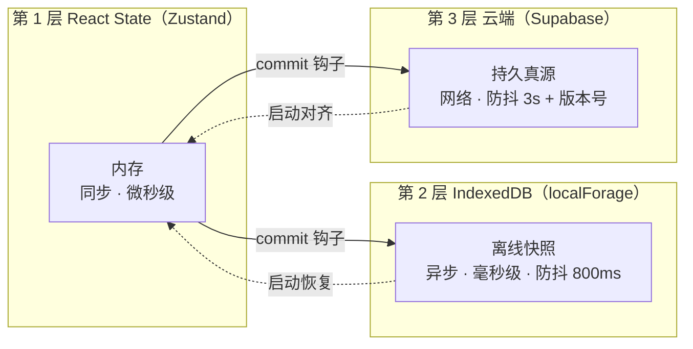

# 第 4 章 状态管理与三层数据持久化

> 对应简历亮点 3：Zustand + persist 中间件驱动的状态管理方案，实现 React State → IndexedDB（localForage）→ 云端 API 的三层数据持久化机制，结合防抖写入策略，平衡响应速度与数据安全性。

## 4.1 为什么是 Zustand（再次收敛成三句话）

1. **订阅粒度**：selector 级订阅，几百节点各自独立重渲染，Context/Redux 默认做不到；
2. **组件外读写**：Agent 工具层、同步层、快捷键系统都要 `useCanvasStore.getState()` / `set()` 直接操作，不需要 dispatch 仪式或 hook 环境；
3. **persist 中间件**：官方支持自定义异步 storage，接 IndexedDB 只需一个适配器。

## 4.2 Store 拆分：按"持久化属性"切，而不是按业务切

```ts
// canvasStore —— 画布实体，唯一业务真源，★持久化
interface CanvasState {
  nodes: Record<string, AppNode>
  edges: Record<string, Edge>
  selection: string[]
  // ---- 基础 CRUD ----
  addNode: (n: AppNode) => void
  updateNodeData: <T extends NodeType>(id: string, patch: Partial) => void
  moveNodes: (ids: string[], delta: Point) => void
  deleteNodes: (ids: string[]) => void          // 内部级联删除关联 edges
  connect: (source: EdgeEndpoint, target: EdgeEndpoint) => ConnectResult
  // ---- 批量事务：一次 action = 一个撤销单元 = 一次持久化 ----
  commit: (recipe: (draft: CanvasDraft) => void, label: string) => void
}

// uiStore —— 纯 UI 态，★永不持久化（视口、面板、拖拽中间态、预览连线）
// sessionStore —— 登录态/当前项目 id，★persist 到 localStorage（小且关键）
```

拆分依据是**持久化属性**：高频临时态（视口、hover、预览）混进持久化 store 会导致"每帧都触发防抖计时器重置"，数据永远写不下去；三者互相 subscribe 而不互嵌。

`commit` 是关键抽象：内部用 immer 产出不可变补丁，一次 commit 内完成 **store 更新 → 撤销栈入栈 → 触发持久化调度 → （可选）广播 Realtime** 四件事，保证"一次用户操作"在所有派生系统里是原子的。

## 4.3 persist 中间件 + IndexedDB 适配

### 4.3.1 为什么不能用默认 localStorage

| 维度 | localStorage | IndexedDB |
|---|---|---|
| 容量 | ~5MB，同步超限直接抛错 | 数百 MB 起 |
| 写入 | **同步阻塞主线程**，画布快照 MB 级会掉帧 | 异步，不阻塞 |
| 数据模型 | 字符串 | 结构化克隆，可直接存对象 |

画布快照（含 base64 缩略图缓存、分镜文本）轻松超过 5MB，且画布应用的写入发生在交互高频期，同步写会造成明显卡顿。所以：**localStorage 只放 sessionStore（几 KB），canvasStore 走 IndexedDB**。

### 4.3.2 适配器实现

```ts
// Zustand persist 要求的 storage 接口：getItem/setItem/removeItem
// localForage 返回值是 Promise，天然匹配 persist 的异步 storage 协议
const idbStorage: StateStorage = {
  getItem: async (name) => (await localforage.getItem<string>(name)) ?? null,
  setItem: async (name, value) => { await localforage.setItem(name, value) },
  removeItem: async (name) => { await localforage.removeItem(name) },
}

export const useCanvasStore = create<CanvasState>()(
  immer(commitWrapper,
  persist(
    (set, get) => ({ /* ...actions */ }),
    {
      name: 'canvas',                                  // IndexedDB 里的 key
      storage: createJSONStorage(() => idbStorage),    // ★ 注入适配器
      version: 3,                                      // schema 版本号
      migrate: migrateCanvasSnapshot,                  // 版本迁移函数链 v2→v3
      // ★ 只持久化业务数据，过滤 UI 态：
      partialize: (s) => ({
        nodes: s.nodes,
        edges: s.edges,
        // selection / drag 状态等全部不存
      }),
    },
  ))
)
```

`partialize` 是容易被忽略的细节：不筛选的话，视口每次变化都会序列化整个 store 写 IndexedDB，既浪费又和真正的业务持久化互相干扰（防抖互相重置）。

## 4.4 三层数据持久化：架构与读写路径



**写路径**（一次 `commit` 触发）：

1. L1 立即生效（内存操作，UI 同帧反馈）；
2. 触发 `persistQueue.schedule('local')` → **800ms 防抖**后把 partialize 快照写入 IndexedDB；
3. 触发 `cloudSync.schedule()` → **3s 防抖**后把快照 + `baseVersion` PUT 到 `/api/canvases/:id`。

**读路径**（应用启动）：

1. 先读 IndexedDB → **立即渲染**（毫秒级首屏，离线可用）；
2. 并行请求云端快照 → 比较 `updatedAt`（快照级 LWW）→ 若云端新则合并覆盖并回写 L2；
3. 云端不可达 → 纯 L2 启动，标记 `pendingSync`，恢复联网后补同步。

**为什么要三层而不是两层**：只有 L1+L3，刷新/断网即丢工作区，首屏要等网络；只有 L1+L2，换设备/清浏览器数据即丢。三层各管一段：**L1 管体验（快）、L2 管离线（稳）、L3 管可靠与多端（真）**。

## 4.5 防抖写入策略与数据安全兜底

```ts
function createPersistScheduler() {
  const localFlush = debounce(flushToLocal, 800)    // L2：本地防抖
  const cloudFlush = debounce(flushToCloud, 3000)   // L3：云端防抖

  function schedule() { localFlush(); cloudFlush() }

  // ★ 兜底 1：页面隐藏/关闭时立即冲刷，不等防抖
  document.addEventListener('visibilitychange', () => {
    if (document.visibilityState === 'hidden') {
      localFlush.flush()
      if (navigator.onLine) cloudFlush.flush()      // 云端 flush 是异步的，
                                                    // 用 keepalive fetch 保证发出
    }
  })
  // ★ 兜底 2：beforeunload 同步保险（fetch keepalive + Blob 快照）
  window.addEventListener('pagehide', flushAllWithKeepalive)
  return { schedule }
}
```

设计权衡（面试必问"防抖期间崩溃丢多少数据"）：

- **丢失窗口**：最坏情况 = 防抖时长（本地 800ms）内的编辑，对创作类应用可接受；
- **为什么本地不定时强制写**：IndexedDB 写入本身是异步事务、毫秒级，防抖 800ms 已足够保守；真正的风险在网络层，所以云端窗口更长（3s）+ 失败进入重试队列；
- **flush 的原子性**：写 IndexedDB 用 `put` 单 key 覆盖快照，天然原子；写云端带 `baseVersion` 乐观锁（见 4.6）。

## 4.6 云端同步协议与冲突处理

```
PUT /api/canvases/:id
  body: { snapshot, baseVersion }        // baseVersion = 本地最后确认的版本
  200 { version }                        // 无人冲突，服务端 version+1
  409 { serverSnapshot, serverVersion }  // 冲突

冲突策略（当前版本）：快照级 Last-Write-Wins
  → 自动：updatedAt 新者胜；被覆盖方的差异节点列表提示用户"已恢复云端版本"
演进方向（面试加分）：节点行级化 + 按节点 LWW；真正的多人并发再上 CRDT/Yjs
```

选择"快照级 LWW 而不是一上来 CRDT"的理由要能讲清：**单人创作是主场景**，冲突概率 = 同一用户两窗口并发编辑，低频；CRDT 引入的复杂度（库体积、merged 语义、与 immer 撤销栈的融合）在当前阶段是负收益。**架构上留了缝**：commit 抽象让未来的 operation-based 同步可以挂在同一个钩子上，不用重写业务层。

## 4.7 撤销重做（画布应用的事实标配）

```ts
interface History {
  past: Patch[][]        // immer 补丁栈：每次 commit 产出的 inversePatches
  future: Patch[][]
  limit: 50              // 上限防内存膨胀
}

// commit(recipe) 内部：
//   produce(state, recipe, (patches, inversePatches) => {
//     past.push(inversePatches); future.length = 0   // 新操作清空 redo 分支
//   })
// undo(): applyPatch(inversePatches) → 触发同一持久化调度（撤销也要持久化！）
```

要点：① 以 **immer 补丁**而非整快照入栈，单步内存从 MB 级降到 KB 级；② 撤销/重做走与正常编辑**同一条 commit 通道**，持久化、Agent 工具、UI 操作自动获得一致行为；③ 补丁栈不持久化（刷新后历史清空是业界通行做法）。

## 4.8 面试考点提炼

1. **"三层数据持久化讲一下"** → 4.4 的读写路径 + "L1 管体验、L2 管离线、L3 管可靠"一句话总结，这是简历第一亮点，必须脱稿；
2. **"persist 怎么接 IndexedDB？"** → 4.3：自定义 `StateStorage` 适配 localForage + `partialize` 过滤 UI 态 + `version/migrate` 迁移；
3. **"防抖窗口崩溃了怎么办？"** → 4.5：说清丢失窗口的量化（≤800ms）+ visibilitychange/pagehide 双兜底 + keepalive；
4. **"冲突怎么办？"** → 4.6：诚实说当前快照级 LWW + 乐观锁 409，再主动讲行级化/CRDT 的演进条件——**知道自己方案的边界**比声称完美更加分；
5. **"为什么不 Redux？"** → 组件外读写 + selector 粒度 + persist 生态三条，回到 4.1；
6. **隐藏深挖点**："撤销栈和持久化怎么共存？" → 4.7 的 commit 单通道设计。
